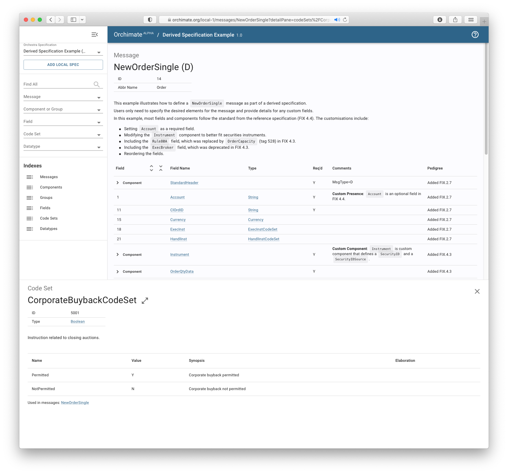

# QuickFIX application

This example demonstrates how to build a QuickFIX application using a QuickFIX data dictionary and corresponding Java code, all generated from a custom Orchestra specification based on the FIX 4.4 reference standard.

Two applications are launched:
* The [QuickFIX engine](./src/main/java/org/example/orchestra/QuickFixEngineDataDictionaryApp.java), running with the custom data dictionary.
* The [QuickFIX client](./src/main/java/org/example/orchestra/QuickFixClientDataDictionaryApp.java), which sends a mix of valid and invalid messages to the engine.

The QuickFIX client sends the following:
* Valid messages that conform to the custom `NewOrderSingle` message defined in the QuickFIX data dictionary.
* Invalid messages missing the required `Account` field.
* Invalid messages containing the `SecondaryOrderID` field, which is not defined in the custom `NewOrderSingle` message.

The example uses the [derived specification](./orchestra/specification/02-quickfix.md) that defines a single custom `NewOrderSingle` message.

## Configuration

### Orchestra plugin

The [build.gradle.kts](./build.gradle.kts) includes the Orchestra plugin with configuration to use a reference standard and enable generation of a QuickFIX data dictionary.

```kotlin
plugins {
  id("io.atomicwire.gradle.orchestra")
}

orchestra {
  specification {
    markdown {
      reference(orchestraHub(name = "fix-4.4", version = "4.4"))
    }
  }

  quickfix {
    dataDictionary {}
  }
}
```

### QuickFIX/J

#### Application parameters

The engine and client applications each contain a QuickFIX/J configuration file, located in the [resources](./src/main/resources) directory.

The generated QuickFIX data dictionary is based on FIX 4.4 and uses [FIXT](https://www.fixtrading.org/family-of-standards/fixt/) for the session layer. As a result, the QuickFIX/J configuration includes the following parameters.


```properties
BeginString=FIXT.1.1
DefaultApplVerID=FIX.4.4
```

Please refer to the [QuickFIX/J user manual](https://www.quickfixj.org/usermanual/2.3.0/usage/configuration.html) for further information.

#### Code generation

The [build.gradle.kts](./build.gradle.kts) file includes a custom Gradle task that invokes the QuickFIX/J code generator to produce the source code for QuickFIX messages, which are used in the FIX engine and client applications. The generated source files are located in the `build/generated/sources/quickfix` directory.

FIXT source code generation is disabled in favor of using the pre-built `FIXT11.xml` transport data dictionary that is available in QuickFIX/J.


## Run

Use the Gradle wrapper to start the QuickFIX engine.

```shell
$ ./gradlew :app-examples:02-quickfix:runServer
```

Then start the QuickFIX client application in a separate console window.

```shell
$ ./gradlew :app-examples:02-quickfix:runClient
```

## Results

Log messages will be displayed in both console windows, illustrating the communication between the QuickFIX engine and client application, as well as the successful processing of a `NewOrderSingle` message.

> **Note**: The QuickFIX engine will terminate automatically after 2 minutes.

### Visualisation

You can search and explore the specification in [Orchimate](https://orchimate.org/).


