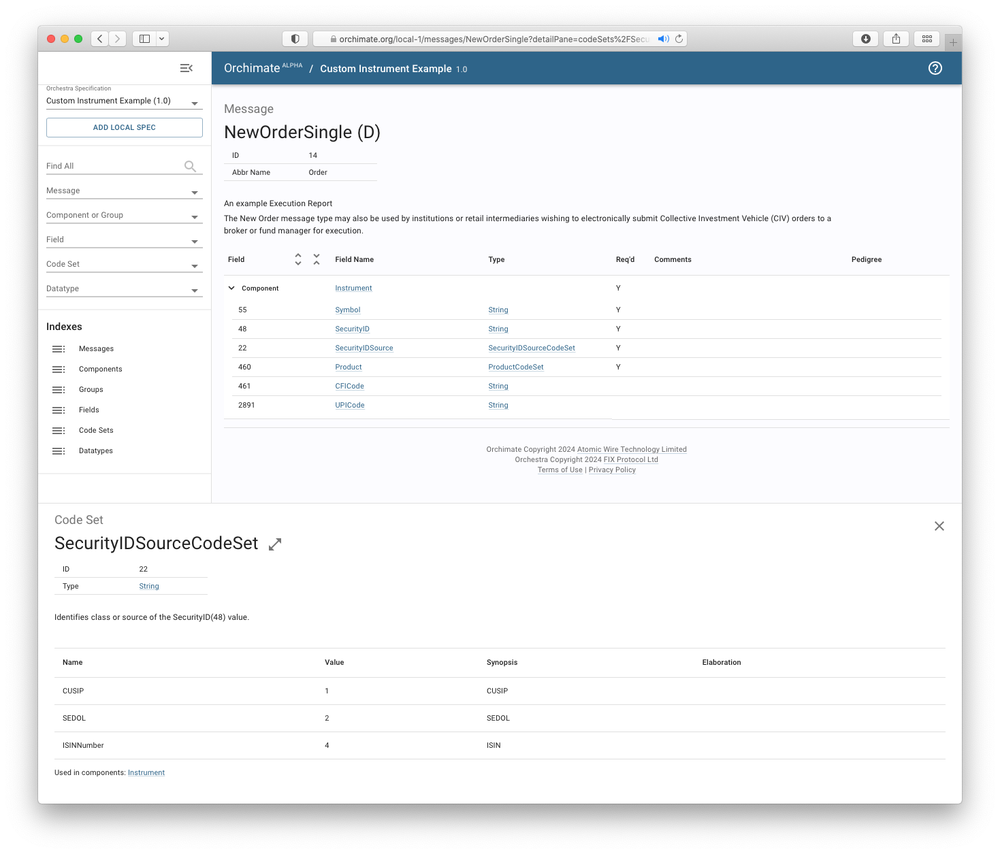

# OpenAPI Spring Boot application

This example demonstrates how to use Orchestra to create an OpenAPI document for a REST API and generate the scaffolding for a Spring Boot web application.

1. First, a JSON Schema is generated from the Orchestra specification.
2. Next, a base OpenAPI document is created, referencing the schemas generated in the first step.
3. Finally, the scaffolding for a Spring Boot application is generated from the combined OpenAPI document.

This example includes an implementation of the generated API scaffolding in [InstrumentApiDelegateImpl.java](
./src/main/java/org/example/orchestra/springboot/InstrumentApiDelegateImpl.java).
> **Note**: This is a dummy implementation that always provides the same response.

## Configuration

This example requires configuration of JSON schema generation in the [build.gradle](./build.gradle) file (as seen in a [previous](../../basic-examples/06-json-schema) example), the addition of a custom Gradle task, and the set up of an OpenAPI documentation generator.

### Orchestra plugin

```groovy
orchestra {
  specification {
    // Specification is derived from fix-latest
    markdown {
      reference orchestraHub(name: 'fix-latest', version: 'ep293')
      enableSpotless()
    }

    // Specify the corresponding JSON datatype for each datatype in the Orchestra specification.
    encoding {
      datatypeMapping([
        double: [
          JSON: 'number',
        ],
        string: [
          JSON: 'string',
        ],
        Pattern: [
          JSON: 'string',
        ],
      ])
    }
  }

  // Generate a JSON Schema for inclusion in the OpenAPI specification
  jsonSchema {
    namespace = 'org.example.orchestra'
  }
}
```
### Gradle task

A custom Gradle task is added to place the two files together, allowing the provided [openapi.yaml](./openapi.yaml) file to easily reference schemas from the JSON schema file generated and later renamed by the plugin.

```groovy
def colocateFiles = tasks.register('colocateOpenApiFiles', Copy) {
  from(orchestraGenerateJsonSchema) {
    rename { 'schemas.json' }
  }
  from 'openapi.yaml'

  into layout.buildDirectory.dir('tmp/openapi')
}
```

### OpenAPI document generator

Finally, a Gradle task `openApiGenerate` is configured to generate the Spring Boot application scaffolding.

```groovy
// Configure the OpenAPI Generator
def openApiGenerate = tasks.named('openApiGenerate', GenerateTask) {
  inputs.dir(colocateOpenApiFiles.map { it.destinationDir })
  inputSpec = colocateOpenApiFiles.map {"${it.destinationDir}/openapi.yaml" as String }

  generatorName = 'spring'

  // Configure the generated code package names
  def basePackage = 'org.example.orchestra.springboot'
  invokerPackage = basePackage
  modelPackage = "${basePackage}.model"
  apiPackage = "${basePackage}.api"
  configOptions.putAll(configPackage: "${basePackage}.config")

  configOptions.putAll(
    delegatePattern: 'true',
    useSpringBoot3: 'true',
  )

  // Skip generating some extraneous files
  generateApiDocumentation  = false
  openapiGeneratorIgnoreList = ['pom.xml', 'src/test/']
  configOptions.putAll([
    documentationProvider: 'none',
    openApiNullable: 'false',
  ])

  outputDir = generatedSourceDir.get().toString()
}
```

## Run

Use the Gradle wrapper to start the Spring Boot server.

```shell
$ ./gradlew :app-examples:03-openapi-springboot:bootRun
```

## Results

You can then query the server over HTTP:

```shell
$ curl localhost:8080/instrument/IBM
```

The server returns the following response.

```json
{"UPICode":null,"Symbol":"IBM","SecurityID":"459200-10-1","SecurityIDSource":"CUSIP","Product":"EQUITY","CFICode":"ESNUOB"}
```

### Visualisation

You can search and explore the specification in [Orchimate](https://orchimate.org/).


