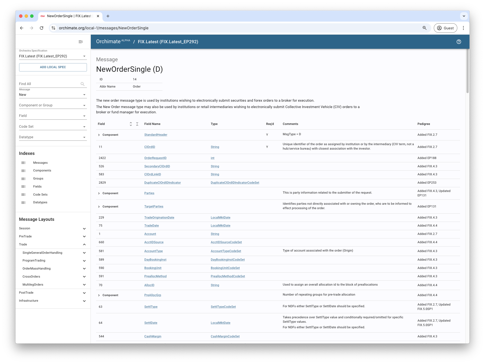

# Orchestra Hub

This example demonstrates how to fetch Orchestra specifications from a remote repository.

[Orchestra Hub](https://orchestrahub.org) is a public platform where organizations can share their Orchestra specifications with the broader community, access specifications published by others, and collaborate on standardization efforts.

The plugin enables users to fetch a specification from the repository, create [derived](../03-derived) versions, and generate artifacts like [code libraries](../07-java) and [schemas](../05-avro-schema) to simplify application integration. 

> **Note**: Orchestra Hub supports versioning, allowing users to update their applications by simply adjusting the version number specified in their build files whenever a new version of a specification is published. 

## Configuration

Specify the `name` and `version` of the specification in the [build.gradle](./build.gradle) file using the `repository` extension.

```groovy
orchestra {
  specification {
    repository orchestraHub(name: 'fix-latest', version: 'ep292')
  }
}
```

## Run

Use the Gradle wrapper to run the example.

```shell
$ ./gradlew :basic-examples:01-orchestra-hub:runExample
```

> **Note**: `runExample` is wired to call the `orchestraBuildSpec` task from the Orchestra plugin.

## Results

The specification will be output to the Gradle build folder.

```shell
$ ./basic-examples/01-orchestra-hub/build/orchestra/specification/01-orchestra-hub.xml
```

### Visualisation

You can search and explore the specification in [Orchimate](https://orchimate.org/), loading it with "Add Local Spec".


