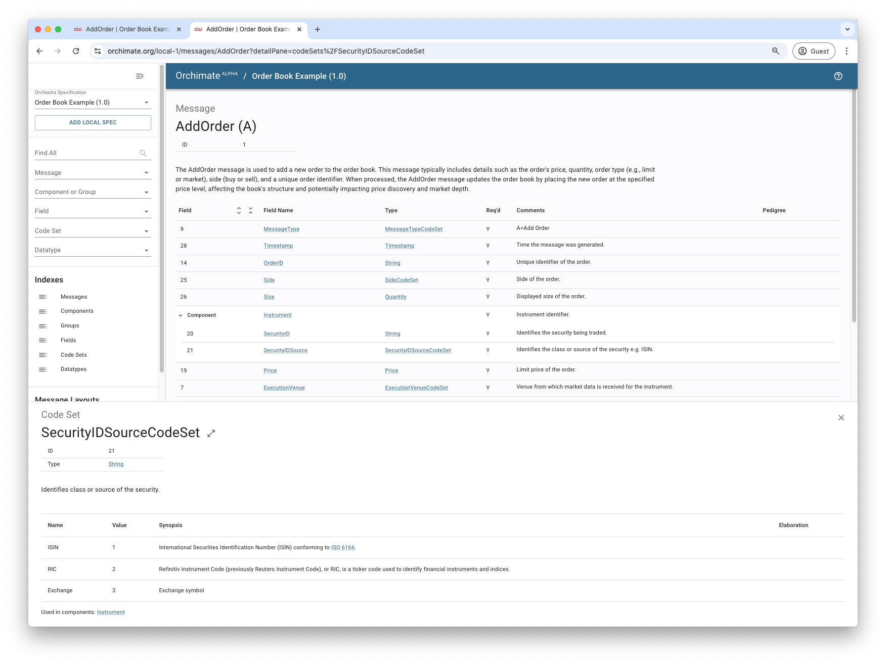

# Markdown

This example demonstrates how to build an Orchestra specification from a Markdown file located on the user's local file system. 

Markdown is a simple and business user-friendly format to create and update Orchestra specifications.

As in the [previous](../01-orchestra-hub) example, the plugin lets users generate build artifacts from the resulting Orchestra specification.

## Configuration

Include the `markdown` extension in the [build.gradle](./build.gradle) file to enable building the Orchestra specification from a Markdown file. 

```groovy
orchestra {
  specification {
    // By default, the plugin will search for a Markdown file at `orchestra/specification/<project-name>.md`.
    markdown {}
  }
}
```

To use a Markdown file in a different location, use the `inputFile` property.

```groovy
orchestra {
  specification {
    markdown {
      inputFile = file("specs/markdown.md")
    }
  }
}
```

### Markdown style checking

The plugin uses [Spotless](https://github.com/diffplug/spotless) to automatically format Orchestra Markdown files and enforce style. This is particularly useful for Markdown specifications with large tables.

To enable this feature, include the `enableSpotless` function in the `markdown` extension.

```groovy
orchestra {
  specification {
    markdown {
      // Enable Spotless to automatically format Orchestra Markdown and enforce style
      enableSpotless()
    }
  }
}
```

The following example shows a Markdown table with two formatting errors:
* The header row is missing a pipe (`|`) at the end
* The `Documentation` column is not aligned to the `ExecutionVenue` row

```markdown
### Message AddOrder Message type A category MarketData (1)

#### Synopsis

The AddOrder message is used to add a new order to the order book. This message typically includes details such as the order's price, quantity, order type (e.g., limit or market), side (buy or sell), and a unique order identifier. When processed, the AddOrder message updates the order book by placing the new order at the specified price level, affecting the book's structure and potentially impacting price discovery and market depth.

| Sort |      Name      |    Tag    | Presence | Documentation                                                              
|------|----------------|-----------|----------|----------------------------------------------------------------------------|
| 1    | MessageType    |           | required | A=Add Order                                                                |
| 2    | Timestamp      |           | required | Time the message was generated.                                            |
| 3    | OrderID        |           | required | Unique identifier of the order.                                            |
| 4    | Side           |           | required | Side of the order.                                                         |
| 5    | Size           |           | required | Displayed size of the order.                                               |
| 6    | Instrument     | component | required | Instrument identifier.                                                     |
| 7    | Price          |           | required | Limit price of the order.                                                  |
| 8    | ExecutionVenue |           | required | Venue from which market data is received for the instrument. |
| 9    | OrderBookType  |           | required | Type of order book.                                                        |
| 10   | OrderType      |           | required | Type of order placed e.g. Limit order.                                     |
| 11   | Participant    |           | required | Identity of trading participant that submitted the order.                  |
```

With Spotless enabled, the `build` task will fail with details of the format violations and the proposed changes.

```shell
FAILURE: Build failed with an exception.

* What went wrong:
Execution failed for task ':basic-examples:02-markdown:spotlessFlexmarkOrchestraCheck'.
> The following files had format violations:
      orchestra/specification/02-markdown.md
          @@ -1,6 +1,6 @@
           #·Order·Book·Management·version·1.0
           
          -|····Term····|·Value··························································································································································································································································································································································································································································································································································································································································································································································|
          +|····Term····|·············································································································································································································································································································································································Value··············································································································································································································································································································································································|
           |------------|----------------------------------------------------------------------------------------------------------------------------------------------------------------------------------------------------------------------------------------------------------------------------------------------------------------------------------------------------------------------------------------------------------------------------------------------------------------------------------------------------------------------------------------------------------------------------------------------------------------------------------------------------------------------------------------------------------------------------------------------------------------|
           |·title······|·Example·Specification·for·Order·Book·Management················································································································································································································································································································································································································································································································································································································································································································|
           |·creator····|·Atomic·Wire·Technology·Limited·································································································································································································································································································································································································································································································································································································································································································································|
          @@ -29,19 +29,19 @@
           
           The·AddOrder·message·is·used·to·add·a·new·order·to·the·order·book.·This·message·typically·includes·details·such·as·the·order's·price,·quantity,·order·type·(e.g.,·limit·or·market),·side·(buy·or·sell),·and·a·unique·order·identifier.·When·processed,·the·AddOrder·message·updates·the·order·book·by·placing·the·new·order·at·the·specified·price·level,·affecting·the·book's·structure·and·potentially·impacting·price·discovery·and·market·depth.
           
          -|·Sort·|······Name······|····Tag····|·Presence·|·Documentation······························································
          -|------|----------------|-----------|----------|----------------------------------------------------------------------------|
          -|·1····|·MessageType····|···········|·required·|·A=Add·Order································································|
          -|·2····|·Timestamp······|···········|·required·|·Time·the·message·was·generated.············································|
          -|·3····|·OrderID········|···········|·required·|·Unique·identifier·of·the·order.············································|
          -|·4····|·Side···········|···········|·required·|·Side·of·the·order.·························································|
          -|·5····|·Size···········|···········|·required·|·Displayed·size·of·the·order.···············································|
          -|·6····|·Instrument·····|·component·|·required·|·Instrument·identifier.·····················································|
          -|·7····|·Price··········|···········|·required·|·Limit·price·of·the·order.··················································|
          +|·Sort·|······Name······|····Tag····|·Presence·|························Documentation·························|
          +|------|----------------|-----------|----------|--------------------------------------------------------------|
          +|·1····|·MessageType····|···········|·required·|·A=Add·Order··················································|
          +|·2····|·Timestamp······|···········|·required·|·Time·the·message·was·generated.······························|
          +|·3····|·OrderID········|···········|·required·|·Unique·identifier·of·the·order.······························|
          +|·4····|·Side···········|···········|·required·|·Side·of·the·order.···········································|
          +|·5····|·Size···········|···········|·required·|·Displayed·size·of·the·order.·································|
          +|·6····|·Instrument·····|·component·|·required·|·Instrument·identifier.·······································|
          +|·7····|·Price··········|···········|·required·|·Limit·price·of·the·order.····································|
           |·8····|·ExecutionVenue·|···········|·required·|·Venue·from·which·market·data·is·received·for·the·instrument.·|
          -|·9····|·OrderBookType··|···········|·required·|·Type·of·order·book.························································|
          -|·10···|·OrderType······|···········|·required·|·Type·of·order·placed·e.g.·Limit·order.·····································|
          -|·11···|·Participant····|···········|·required·|·Identity·of·trading·participant·that·submitted·the·order.··················|
          +|·9····|·OrderBookType··|···········|·required·|·Type·of·order·book.··········································|
          +|·10···|·OrderType······|···········|·required·|·Type·of·order·placed·e.g.·Limit·order.·······················|
          +|·11···|·Participant····|···········|·required·|·Identity·of·trading·participant·that·submitted·the·order.····|
           
           ###·Message·ModifyOrder·type·M·category·MarketData·(2)
           
  Run './gradlew :basic-examples:02-markdown:spotlessApply' to fix these violations.

* Try:
> Run with --stacktrace option to get the stack trace.
> Run with --info or --debug option to get more log output.
> Run with --scan to get full insights.
> Get more help at https://help.gradle.org.

BUILD FAILED in 3s
16:42:25: Execution finished 'build'.
```

To apply the proposed changes, run the `spotlessApply` task.

```shell
$ './gradlew :basic-examples:02-markdown:spotlessApply'
```

## Run

Use the Gradle wrapper to run the example.

```shell
$ ./gradlew :basic-examples:02-markdown:runExample
```

> **Note**: `runExample` is wired to call the `orchestraBuildSpec` task from the Orchestra plugin.

## Results

The spec will be output to the Gradle build folder.

```shell
$ ./basic-examples/02-markdown/build/orchestra/specification/02-markdown.xml
```

### Visualisation

You can search and explore the specification in [Orchimate](https://orchimate.org/).


