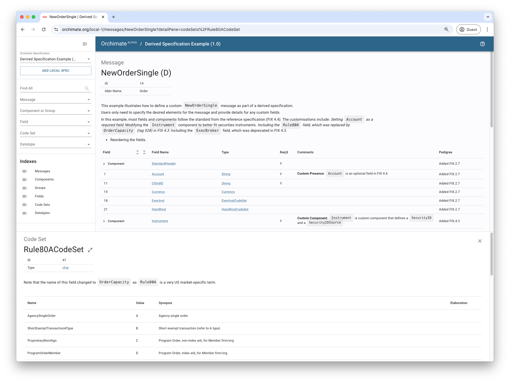

# Derived Specifications

This example demonstrates how to create a derived specification based on a reference standard. 

Using a reference specification greatly simplifies the management of custom specifications by allowing standard elements to be inherited rather than redefined. This allows users to focus exclusively on data customisations required for their business. 

As in the [previous](../02-markdown) example, the derived specification is described in a Markdown file located on the user's local file system. Here, the plugin is configured to use [FIX.4.4](https://orchestrahub.org/-/fix-4.4) as the reference specification.

The derived specification features a single custom FIX message incorporating user-defined fields not part of the FIX standard, along with deprecated fields from earlier versions of FIX that are needed for backward compatibility. 

## Configuration

The reference specification is configured in the [build.gradle.kts](./build.gradle.kts) file using the `reference` parameter. 

The [Markdown file](./orchestra/specification/03-derived.md) for the derived specification is in the default location so does not need to be configured.

```kotlin
orchestra {
  specification {
    markdown {
      // Specify the name and version of the reference specification
      reference(orchestraHub(name = "fix-4.4", version = "4.4"))
    }
  }
}
```

## Run

Use the Gradle wrapper to run the example.

```shell
$ ./gradlew :basic-examples:03-derived:runExample
```

> **Note**: `runExample` is wired to call the `orchestraBuildSpec` task from the Orchestra plugin.


## Results

The spec will be output to the Gradle build folder.

```shell
$ ./basic-examples/03-derived/build/orchestra/specification/03-derived.xml
```

### Visualisation

You can search and explore the specification in [Orchimate](https://orchimate.org/).


