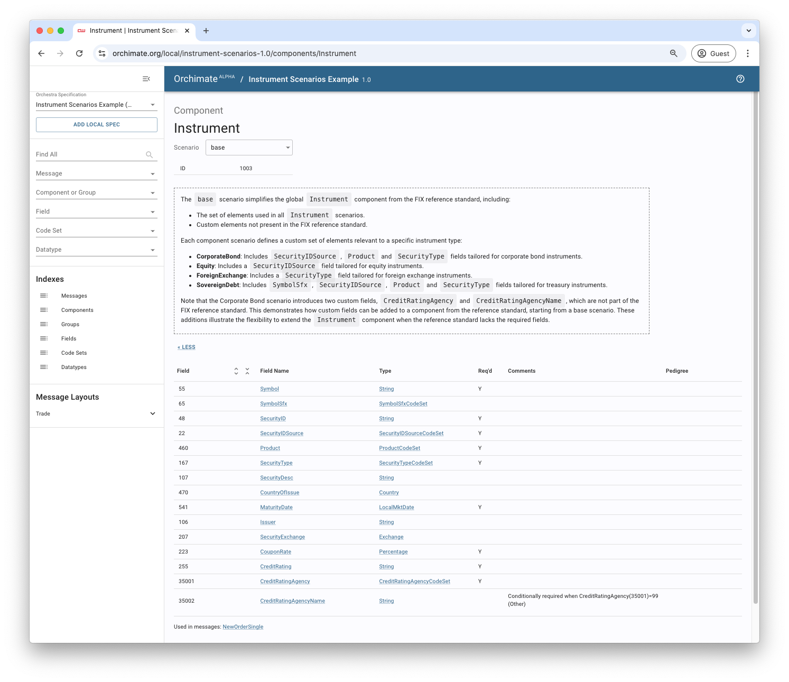

# Scenarios

This example demonstrates how to use scenarios to simplify and customize message definitions for specific contexts.

A scenario is a streamlined version of a global message definition. By omitting elements that are unnecessary for a particular use case, scenarios make messages easier to implement while remaining focused on specific requirements.

For example, brokers may define scenarios for the `NewOrderSingle` message to accommodate different workflows, such as retail clients, institutional investors, or direct market access (DMA).

Scenarios offer flexibility to create specialized message versions, including:
- **Straight Through Processing (STP)**: Exclude options requiring manual processing, ensuring full automation.
- **Algorithmic Trading**: Include instructions identifying trading strategies and related algo parameters.
- **Asset-Class Specific**: Tailored for specific instruments, such as equities, fixed income, or derivatives.

Orchestra scenarios function similarly to ISO 20022 [variants](https://www.iso20022.org/catalogue-messages/additional-content-messages/variants), enabling customization of global standards to diverse implementation needs. 

> **Info**: Whereas ISO 20022 variants are limited to messages, Orchestra allows scenarios to be defined for any element type including messages, components, groups, fields, and codesets.

As in the [previous](../02-markdown) example, the derived specification is described in a Markdown file located on the user's local file system. The plugin is configured to use [FIX Latest](https://orchestrahub.org/-/fix-latest) as the reference specification.

The derived specification features a custom `NewOrderSingle` message with `base` scenario that includes only the required elements from the FIX reference standard. 

Additionally, four message scenarios are provided, each featuring a customized `Instrument` component tailored to a specific asset class: `CorporateBond`, `Equity`, `ForeignExchange`, and `SovereignDebt`. The sub-elements of each `Instrument` component are refined using scenarios according to the specific requirements of the asset class.

## Configuration

The reference specification is configured in the [build.gradle](./build.gradle) file using the `reference` parameter. 

The [Markdown file](./orchestra/specification/10-scenarios.md) for the derived specification is in the default location so does not need to be configured.

```groovy
orchestra {
  specification {
    markdown {
      // Specify the name and version of the reference specification
      reference orchestraHub(name: 'fix-latest', version: 'ep292')
    }
  }
}
```

## Run

Use the Gradle wrapper to run the example.

```shell
$ ./gradlew :basic-examples:10-scenarios:runExample
```

> **Note**: `runExample` is wired to call the `orchestraBuildSpec` task from the Orchestra plugin.


## Results

The spec will be output to the Gradle build folder.

```shell
$ ./basic-examples/10-scenarios/build/orchestra/specification/10-scenarios.xml
```

### Visualisation

You can search and explore the specification in [Orchimate](https://orchimate.org/).


